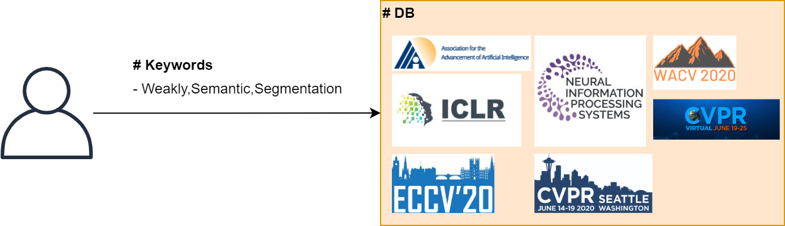
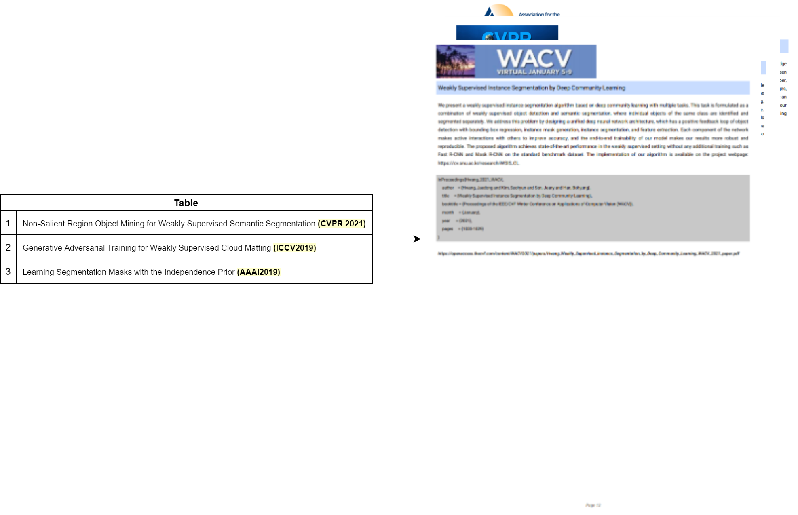
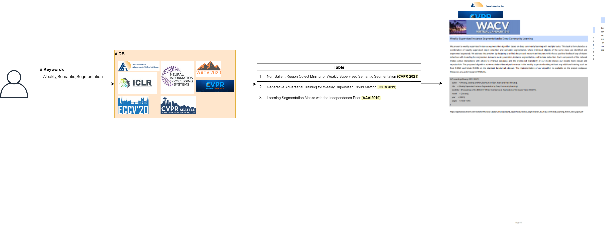

# Motivation
- 일반적으로 새로운 기술 개발을 하기 위해 수 많은 논문들을 읽고, 핵심 내용을 기반으로 새로운 기술을 개발합니다. 구체적으로 내가 검색하고 싶은 키워드들을 찾고, impact factor가 높은 학회 순, 연도 순으로 검색합니다. 관심있는 논문들을 정리한 뒤 title, abstract 위주로 읽어보며 깊게 읽을 논문을 선정하게 됩니다.
- 이때, 가장 불편한 점이 학회마다 저장된 논문 형식이 다르고, title, abstract 확인을 위해 일일히 검색해서 들어가야 한다는 점입니다. 위 문제를 해결하고자 제가 개발한 Crawler는 내가 입력한 키워드를 유명한 학회들에서 크롤링한 논문들을 빠르게 찾고, 하나의 파일로 합쳐줍니다.

# Overview

### Step 1. Query keywords in DB
- 


### Step 2. Insert searched papers into a pdf file
- 


### Summary 
- 


# Installation

### 1. PIP 
```bash
pip install requests
pip install bs4

pip install arxiv
pip install doi2bib
pip install bibcure

pip install fpdf
pip install pdfplumber

pip install git+https://github.com/titipata/scipdf_parser
```

### 2. Requirements
```bash
pip install -r requirements.txt
```

### 3. Docker (TODO)
```bash
```

# Usage
- 
```bash
python make_pdf_file_using_keywords.py --keywords weakly,object,localization --pdf_path ./results/WSOL.pdf
python make_pdf_file_using_keywords.py --keywords weakly,semantic,segmentation --pdf_path ./results/WSSS.pdf 
python make_pdf_file_using_keywords.py --keywords weakly,object,detection --pdf_path ./results/WSOD.pdf 
python make_pdf_file_using_keywords.py --keywords weakly,instance,segmentation --pdf_path ./results/WSIS.pdf
```

# Effectiveness
- 효과를 입증하기 위해 키워드 및 학회를 정하고, 원하는 논문 10개를 찾아보았고, 이때 걸리는 시간을 비교해봤습니다.
- CVPR 기준으로 Weakly-Supervised 란 키워드가 들어간 원하는 논문 10개를 찾기 위해 걸리는 시간은 대략 ~~초였고, Crawler를 활용하여 찾을 경우 ~초였습니다. 약 ~배 더 빠른 속도로 원하는 논문을 검색할 수 있었습니다.

# Available Conference List
- [x] CVPR 2017
- [x] CVPR 2018
- [x] CVPR 2019
- [x] CVPR 2020
- [x] CVPR 2021

- [x] ICCV 2017
- [x] ICCV 2019
- [ ] ICCV 2021

- [x] WACV 2020
- [x] WACV 2021

- [x] ECCV 2018
- [x] ECCV 2020

- [x] NIPS 2017
- [x] NIPS 2018
- [x] NIPS 2019
- [x] NIPS 2020
- [ ] NIPS 2021

- [ ] ICML 2017
- [ ] ICML 2018
- [ ] ICML 2019
- [ ] ICML 2020
- [ ] ICML 2021

- [x] ICLR 2018
- [x] ICLR 2019
- [x] ICLR 2020
- [ ] ICLR 2021

- [ ] AAAI 2017
- [ ] AAAI 2018
- [x] AAAI 2019
- [x] AAAI 2020
- [x] AAAI 2021

# TODO List
- [X] Crawl title, abstract, bibtex and pdf_url per a conference.
- [x] Search the papers using the keywords which the user typed. 
- [ ] Add figures and tables in the PDF.
- [ ] Add GUI
- [ ] Provide the other formats. (XLSX, Notion)
- [ ] Make word cloud using title and abstract.

# Reference
- https://github.com/hoya012/CVPR-2021-Paper-Statistics
- https://scholarly.readthedocs.io/en/latest/quickstart.html#example
- https://github.com/titipata/scipdf_parser