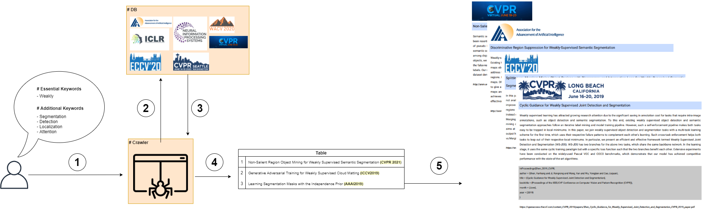

# Motivation
Most researchers read papers to find new things or develop new algorithms. For example, when I searched articles about weakly supervised semantic segmentation, I should spend the time. Specifically, I divided the searching procedure into three steps. 

1. Seek the papers on some browser. (ex. Google Scholar)
2. Make the list of papers.
3. Read the abstract of a paper to decide to study the details.

To tackle this issue, I focused on how to check the validity of the paper quickly. So, I defined four principal parts which are title, abstract, tables, and figures. Also, I developed the crawler to create the list associated with keywords the user typed automatically. 

In the next section, I am going to explain the details of the crawler. 

<br>

# Overview



Step 1. Request essential and additional keywords to the crawler
Step 2. Query the keywords the user chose into DB
Step 3. Return the papers associated with the keywords. 
Step 4. Make the table of the papers from DB. 
Step 5. Export as a PDF file from the table. 

<br>

# Installation

### 1. PIP 
```bash
pip install requests
pip install bs4

pip install arxiv
pip install doi2bib
pip install bibcure

pip install fpdf
pip install pdfplumber

pip install refextract

pip uninstall python-magic
pip install python-magic-bin==0.4.14
```

### 2. Requirements
```bash
pip install -r requirements.txt
```

### 3. Docker (TODO)
```bash
```

# Usage
- 
```bash
python make_pdf_file_using_keywords.py --keywords weakly,object,localization --pdf_path ./results/WSOL.pdf
python make_pdf_file_using_keywords.py --keywords weakly,semantic,segmentation --pdf_path ./results/WSSS.pdf 
python make_pdf_file_using_keywords.py --keywords weakly,object,detection --pdf_path ./results/WSOD.pdf 
python make_pdf_file_using_keywords.py --keywords weakly,instance,segmentation --pdf_path ./results/WSIS.pdf

python make_pdf_file_using_keywords.py --keywords superpixel --pdf_path ./results/SuperPixel.pdf
python make_pdf_file_using_keywords.py --keywords semi,semantic,segmentation --pdf_path ./results/Semi-Supervised_Semantic_Segmentation.pdf

python make_pdf_file_using_keywords.py --keywords semantic,segmentation --pdf_path ./results/SS.pdf --years 2021,2020,2019
python make_pdf_file_using_keywords.py --keywords semantic,segmentation --pdf_path ./results/SS.pdf --years 2021
```

# Available Conference List
- [x] CVPR 2017
- [x] CVPR 2018
- [x] CVPR 2019
- [x] CVPR 2020
- [x] CVPR 2021

- [x] ICCV 2017
- [x] ICCV 2019
- [ ] ICCV 2021

- [x] WACV 2020
- [x] WACV 2021

- [x] ECCV 2018
- [x] ECCV 2020

- [x] NIPS 2017
- [x] NIPS 2018
- [x] NIPS 2019
- [x] NIPS 2020
- [ ] NIPS 2021

- [ ] ICML 2017
- [ ] ICML 2018
- [ ] ICML 2019
- [ ] ICML 2020
- [ ] ICML 2021

- [x] ICLR 2018
- [x] ICLR 2019
- [x] ICLR 2020
- [x] ICLR 2021 

- [ ] AAAI 2017
- [ ] AAAI 2018
- [x] AAAI 2019
- [x] AAAI 2020
- [x] AAAI 2021

# TODO List
- [X] Crawl title, abstract, bibtex and pdf_url per a conference.
- [x] Search the papers using the keywords which the user typed. 
- [ ] Add figures and tables in the PDF.
- [ ] Add GUI
- [ ] Provide the other formats. (XLSX, Notion)
- [ ] Make word cloud using title and abstract.
- [ ] Show figure, abstract, and title per a paper. 

# Reference
- https://github.com/hoya012/CVPR-2021-Paper-Statistics
- https://scholarly.readthedocs.io/en/latest/quickstart.html#example
- https://github.com/titipata/scipdf_parser
- https://github.com/evanzd/ICLR2021-OpenReviewData